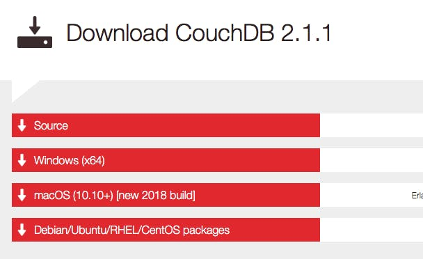
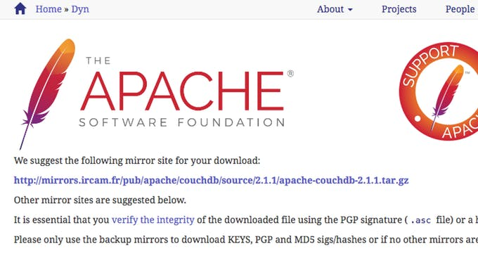
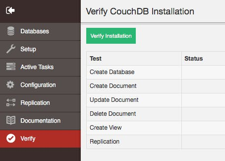
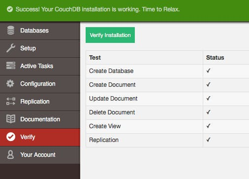
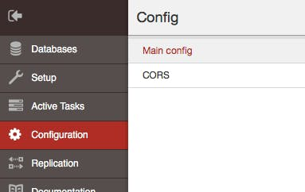
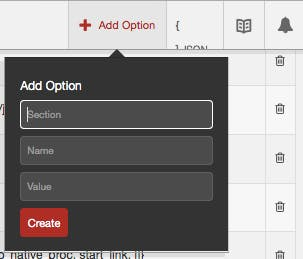
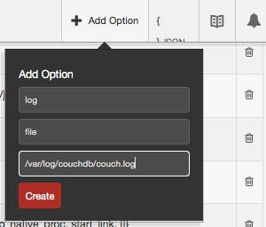

# How to install CouchDB on Raspbian Stretch / Raspberry PI #

> Also published on [hackster.io](https://www.hackster.io/mehealth-ch/installing-couchdb-on-raspbian-stretch-ccb2a7).

## Objective ##

This tutorial is a step by step explanation on how to install the [NOSQL database CouchDB](http://couchdb.apache.org/) on a Raspberry Pi with [Raspbian Stretch OS](https://www.raspberrypi.org/downloads/raspbian/).

## Plan ##

The plan for this tutorial is

- [Short introduction on what is CouchDB?](#1-short-introduction-on-what-is-couchdb)
- [Prerequisites for the Raspberry Pi](#2-prerequisite-for-the-raspberry-pi).
- [CouchDB download, build and installation](#3-download-build-and-install-software).
- [First run and check](#4-first-run-and-check).
- [Script for running CouchDB on boot](#5-script-for-running-couchdb-on-boot).
- [Personal experiences with CouchDB](#6-personal-experiences-with-couchdb).

---

# 1. Short introduction on what is CouchDB? #

CouchDB is an awesome and very reliable NOSQL database server which stores JSON documents. CouchDB can be run from a Raspberry Pi to big servers. A version built for mobile and desktop web-browsers is named [PouchDB](http://pouchdb.com/) and [Couchbase Lite](https://developer.couchbase.com/documentation/mobile/current/guides/couchbase-lite/index.html) is built for native iOS & Android apps. It is very easy to store and query documents with CouchDB databases and data can be replicated seamlessly with each other.

The [Apache CouchDB website](http://couchdb.apache.org/) says:

> Data Where You Need It
>
> Apache CouchDB™ lets you access your data where you need it by defining the **Couch Replication Protocol** that is implemented by a variety of projects and products that span every imaginable computing environment **from globally distributed server-clusters**, over **mobile phones** to **web browsers**. Software that is compatible with the Couch Replication Protocol include: PouchDB, Cloudant, and Couchbase Lite.

> Store your data **safely**, on your own servers, or with any leading cloud provider. Your web- and native applications love CouchDB, because it speaks **JSON natively** and supports binary for all your data storage needs. **The Couch Replication Protocol** lets your data flow seamlessly between server clusters to mobile phones and web browsers, enabling a compelling, **offline-first** user-experience while maintaining high performance and strong reliability. CouchDB comes with a **developer-friendly query language**, and optionally MapReduce for simple, efficient, and comprehensive data retrieval.

---

# 2. Prerequisite for the Raspberry Pi. #

This step by step tutorial has been tested many time with the following configuration:

**Hardware** : Raspberry Pi 2B, 3B and 3B+.

**OS**: Raspbian Stretch.

**Network**: you should have an Internet access to download and install software.

**SSH** : you can install CouchDB with SSH or in a Terminal session on the Pixels interface directly on the Raspberry Pi.

First, check that you have the correct OS version by executing in a Terminal:

	cat /etc/os-release

You should get something like:
	
	# PRETTY_NAME="Raspbian GNU/Linux 9 (stretch)"
	# NAME="Raspbian GNU/Linux"
	# VERSION_ID="9"
	# VERSION="9 (stretch)"
	# ID=raspbian
	# ID_LIKE=debian
	# HOME_URL="http://www.raspbian.org/"
	# SUPPORT_URL="http://www.raspbian.org/RaspbianForums"
	# BUG_REPORT_URL="http://www.raspbian.org/RaspbianBugs"

Then, ensure your system is up to date with:

	sudo apt-get update
	sudo apt-get dist-upgrade

---

# 3. Download, build and install software. #

Now, we add the Erlang Solutions repository and public key with:

	wget http://packages.erlang-solutions.com/debian/erlang_solutions.asc
	sudo apt-key add erlang_solutions.asc
	sudo apt-get update

and install all build dependencies with this three-lines command (copy and paste all 3 lines together in the terminal):

	sudo apt-get --no-install-recommends -y install build-essential \
	pkg-config erlang libicu-dev \
	libmozjs185-dev libcurl4-openssl-dev

Now, create a new user named couchdb and its home directory:

	sudo useradd -d /home/couchdb couchdb
	sudo mkdir /home/couchdb
	sudo chown couchdb:couchdb /home/couchdb

Ensure you are on you home directory with:

	cd

To download Apache CouchDB source code, first open the following link:

[http://couchdb.apache.org/#download](http://couchdb.apache.org/#download)

and click on the Source link as seen in the following picture:

The following page will be displayed:

Now, copy the suggested mirror site for your download (e.g. control-click on the link and choosing copy in popup menu), and paste the link after the `wget` in your terminal. You should execute something like:

	wget http://mirror.ibcp.fr/pub/apache/couchdb/source/2.1.1/apache-couchdb-2.1.1.tar.gz   

which download the source archive file. Extract the archive and enter the resulting source directory (maybe you have to adapt the name of the archive `.gz` file and its corresponding directory):

	tar zxvf apache-couchdb-2.1.1.tar.gz
	cd apache-couchdb-2.1.1/

You can now build and make the CouchDB executable:

	./configure
	make release

Finally, copy the built release to the appropriate couchdb user directory:

	cd ./rel/couchdb/
	sudo cp -Rp * /home/couchdb
	sudo chown -R couchdb:couchdb /home/couchdb

Now, CouchDB is installed and ready for a first run.

If you want you can now remove unnecessary files (adapt to the name of your previous download) with:

	cd
	rm -R apache-couchdb-2.1.1/
	rm apache-couchdb-2.1.1.tar.gz
	rm erlang_solutions.asc

---

# 4. First run and check. #

If you install CouchDB with SSH you are probably willing to connect to the CouchDB server from **external IP addresses** (i.e. remotely from the Pi). In this case, you have to edit the `/home/couchdb/etc/local.ini` file:

	sudo nano /home/couchdb/etc/local.ini

and change the line from:

	#bind_address = 127.0.0.1

to (dont miss to delete the 1st '#' character):

	bind_address = 0.0.0.0

IMPORTANT ! If you want to securely keep the access to CouchDB only from the Raspberry locally (localhost and not remote) then you should not change the bind_address to 0.0.0.0. You can still change the configuration later at any time.

Now, you are ready to run CouchDB as `couchdb` user with this command:
	
	sudo -i -u couchdb /home/couchdb/bin/couchdb

it display its log in console. Dont worry if you see some warning or even error messages in this first run of CouchDB.

Open, your Browser in Raspberry and go to the following link&nbsp;: [http://192.168.1.177:5984/_utils/](http://192.168.1.177:5984/_utils/). Use whatever IP your raspberry has with port **5984**, or [http://localhost:5984/_utils/](http://localhost:5984/_utils/).

Then, click on the verify button on left:

then on the green `Verify Installation` button to check your installation. If everything is correct, you will get:

Look at the [CouchDB Documentation](http://docs.couchdb.org/en/latest/) for more information and especially to configure your CouchDB server (administrator, single or multi-cluster, enabling CORS, etc.).

---

# 5. Script for running CouchDB on boot. #

If like me CouchDB is the main database server for your projects, then you want CouchDB to start automatically on booting your Raspberry Pi. To achieve this we use `systemd` and create a configuration as described below.

First, create a directory owned by `couchdb` user for your CouchDB logs:

	mkdir /var/log/couchdb/
	sudo chown couchdb:couchdb /var/log/couchdb

Then, make sure that CouchDB is still running, then in your Browser go to CouchdDB `Configuration` page [http://127.0.0.1:5984/_utils/#/_config](http://127.0.0.1:5984/_utils/#/_config). If you previously defined an administrator you will be asked to log in as the administrator.

Click on the `+Add Option` and fill the form like here:

>>Empty form.

>>Values to set.

values are:

- `log` for Section,
- `file` for Name and 
- `/var/log/couchdb/couch.log` for Value.

Click on `Create`.

Now, scroll to Configuration Section **log** and change the value of the property named **writer** from `sterr` to `file` (double-click on word `stderr`) as in:

This tell CouchDB to write its log from now to file `/var/log/couchdb/couch.log`.

Now, create the service by editing a new file:

	sudo nano /lib/systemd/system/couchdb.service

and paste the following to the content of the editor:

	[Unit]
	Description=CouchDB Service
	After=network.target
	  
	[Service]
	Type=idle
	User=couchdb
	Restart=always
	ExecStart=/home/couchdb/bin/couchdb
	  
	[Install]
	WantedBy=default.target
	
Then, fix file permissions with:

	sudo chmod 644 /lib/systemd/system/couchdb.service

and instruct `systemd` to start the service during the boot sequence:

	sudo systemctl daemon-reload
	sudo systemctl enable couchdb.service

When you reboot the Pi the couchdb service should run:

	sudo reboot

and check service status using:

	sudo systemctl status couchdb.service

Also, either browse to page [http://localhost:5984](http://localhost:5984/) to check that CouchDB server is up and running, or execute in your terminal:

	curl http://localhost:5984

which should reply something like :

	{"couchdb":"Welcome","version":"2.1.1","features":["scheduler"],"vendor":{"name":"The Apache Software Foundation"}}

---

**Now, you are ready to enjoy all CouchDB server capabilities !**

Have a look to [CouchDB Documentation](http://docs.couchdb.org/en/latest/) and enjoy [PouchDB](http://pouchdb.com/) in your browser, mobile or [NodeJS](http://nodejs.org/) projects.

---

# 6. Personal Experiences with CouchDB #

We use CouchDB since 2009. It stability, ease of use, reliability, data safety, performance and many features (like replication) fit our needs. We use CouchDB mainly with PouchDB javascript library in the browser and in NodeJS. We have instances of CouchDB running on Raspbian efficiently and without issues.

An example of awesome feature it the [`_changes API`](http://docs.couchdb.org/en/2.1.1/api/database/changes.html) which allows us to listen to databases changes and update graphs or other IoT events in realtime both in the browser and in NodeJS servers. To implement it quickly, have a look to the example usage at [pouchdb.com/api.html#changes](https://pouchdb.com/api.html#changes).

## Hire us ! ##

If you have some projects using CouchDB and would like us to help, please get in touch with us&nbsp;!

---

Your Feedback and suggestions for improvements would be welcome !  
Joël